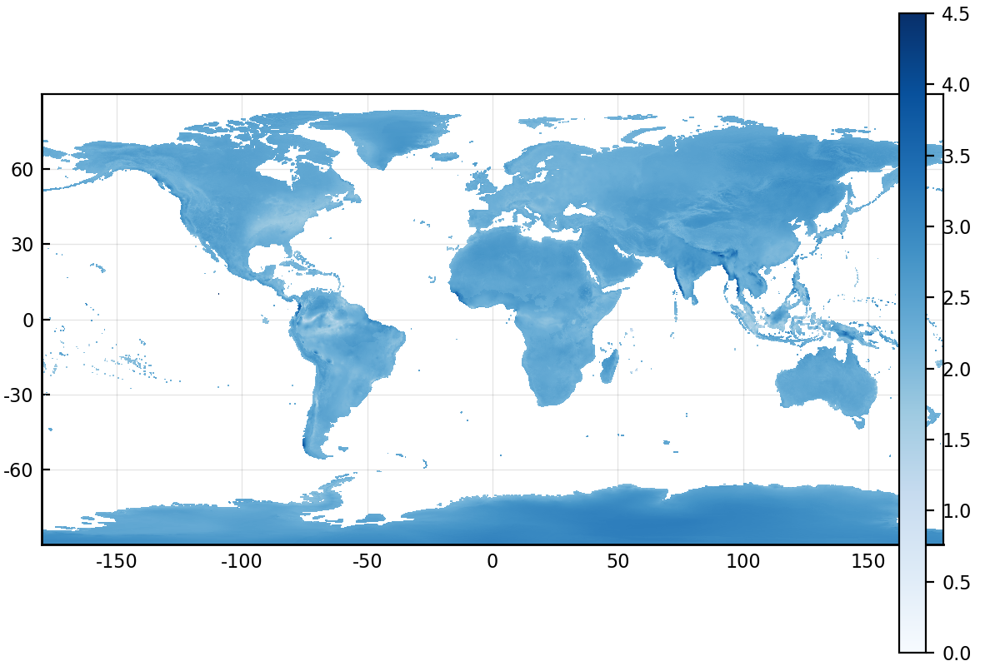
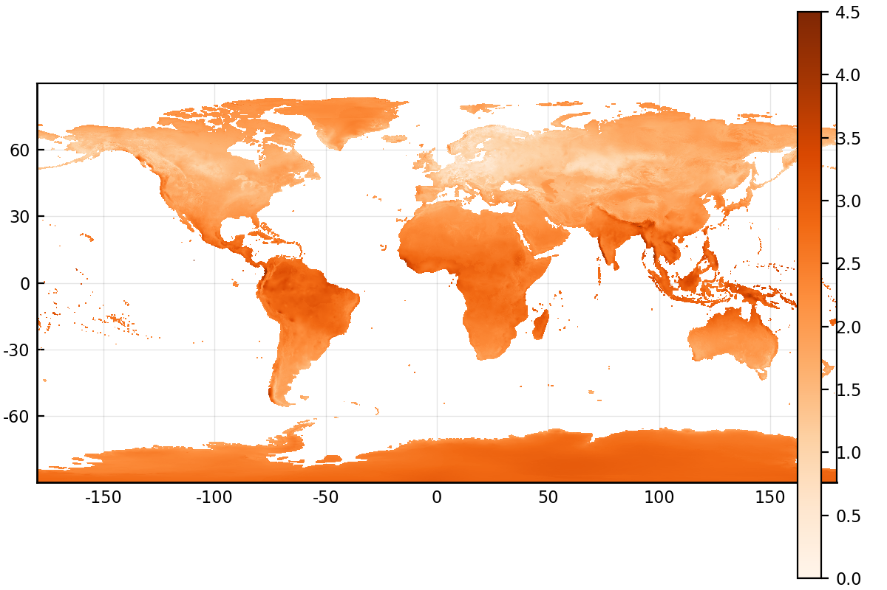
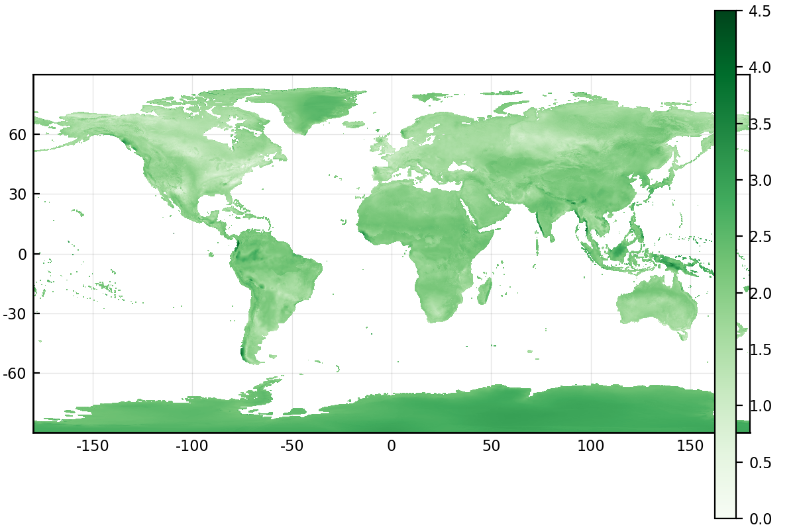

# Introduction

Ecological networks are a useful way to think about ecological systems in which species or organisms interact [@HeleGarc14; @DelmBess18; @PoisStou16], and recently there has been an explosion of interest in their dynamics across large temporal scales [@BaisGrav19; @TyliMorr17], and especially
along environmental gradients [@PellAlbo17; @TrojOles16]. As ecosystems and climates are changing rapidly, networks are at risk of unravelling: for example by invasion of destabilizing exotic species
them [@MagrHolz17; @StroLero14], or by a "rewiring" of interactions among existing species [@HuiRich19; @GuidBart19]. Simulation studies suggest that knowing the shape of the extant network is not sufficient [@ThomGonz17], and that it needs to be supplemented by additional data on the species in the food web, climate, and climate projection.

This renewed interest in ecological networks has prompted several methodological efforts. First, an expansion of the analytical tools to study ecological networks and their variation in space [@PoisCana12; @PoisStou15; @PoisGuev17]. Second, an improvement in large-scale data-collection, through increased adoption of molecular biology tools [@EitzAbre19; @EvanKits16]  and crowd-sourcing of data collection [@BahlLand16; @RoyBaxt16; @PocoRoy15]. Finally, a surge in the development of tools that allow us to *infer* species interactions [@MoraMati15] based on limited but complementary data on existing network properties [@StocPois17], species traits [@GravPois13; @DesjLaig17; @BrouGrav17; @BartGrav16], and environmental conditions [@GravBais18]. These latter approaches tend to perform well in data-poor environments [@BeauDesj16], and can be combined through ensemble modeling or model averaging to generate more robust predictions [@PomeThom18]. The task of inferring interactions is particularly important because ecological networks are difficult to adequately sample in nature [@Jord16; @BanaCatt04; @ChacVazq12; @GibsKnot11]. The common goal to these efforts is to facilitate the prediction of network structure, particularly over space [@PoisGrav16; @GravBais18; **MARINE FOODWEB**] and into the future [@AlboVele14], and to appraise the response of that structure to possible environmental changes.

These disparate methodological efforts share another important characteristic: their continued success depends on state-of-the art data management. Novel quantitative tools demand a higher volume of network data; novel collection techniques demand powerful data repositories; novel inference tools demand easier integration between different types of data, including but not limited to interactions, species traits, taxonomy, occurrences, and local bioclimatic conditions. In short, advancing the science of ecological networks requires us not only to increase the volume of available data, but to pair these data with ecologically relevant metadata. Such data should also be made available in a way that facilitates programmatic interaction so that they can be used by reproducible data analysis pipelines.

@PoisBais16 introduced `mangal.io` as a first step in this direction. In the years since the tool was originally published, we continued development of the data representation, amount and richness of metadata, and digitized and standardized as much ecological data as we could find. The second major release of this database contains over 1300 networks, 120000 interactions across close to 7000 taxa, and represents what is to our best knowledge the most complete collection of species interactions available. We seek to assess the utility of ecological networks at the global scale to support synthesis research. Based on temporal and spatial biases in the description of some types of interactions, we conclude that while there is an increasing amount of available data, most of the planet's surface is poorly described. In particular, Africa, South America, and most of Asia have very sparse coverage. This suggests that the accuracy of synthesis efforts on the worldwide structure or properties of ecological networks will have very low predictive values within these areas, and reinforces the need to digitize available information, but also prioritize sampling towards these locations.
<!-- TD: The final sentence is a strong statement. I don't disagree, but damn. I think I'm perhaps more on the side of "well this is what we have, let's try to correct for inherent biases and explore general relationships". Perhaps a few sentences could be included about using with this approach with the idea of a dynamic analysis, where analyses are automatically re-done as more data get added, allowing a sort of continuous assessment of proposed ecological relationships? -->

<!-- @BorrMood14 identified network ecology as one of the fastest growing sub-field in the ecological sciences. -->

**Main question**
Here we address the question of what we can and cannot do with this large store of ecological network data.

* A major challenge to ecological synthesis is generalizing from samples to the behaviour of ecological systems
* two obstacles to such generalizing in ecological systems: data coverage and data quality
  - data coverage: are data collected from every relevant system?
  - data quality: are data fit-for-purpose? Two particular aspects of quality
    - taxonomic resolution
    - sampling effort
  Synthesizing ecological data presents important challenges and also some
  exciting opportunities. Mangal is well suited to offer such opportunities
  in the study of ecological networks.

# Global trends in ecological networks description

## Network coverage is accelerating but spatially biased

![Cumulative number of ecological networks available in `mangal.io` as a function of the date of collection. About 1000 unique networks have been collected between 1987 and 2017, a rate of just over 30 networks a year. This temporal increase proceeds at different rates for diferent types of networks; while the description of food webs is more or less constant, the global acceleration in the dataset is due to increased interest in host-parasite interactions starting in the late 1970s, while mutualistic networks mostly started being recorded in the early 2000s.](figures/figure_01_a.png){#fig:temporal}

The earliest recorded ecological networks date back to the late nineteenth century, with a strong increase in the rate of collection around the 1980s (+@fig:temporal). Although the volume of available networks has increased over time, the sampling of these networks in space has been uneven. In +@fig:spatial, we show that globally, network collection is biased towards the Northern hemisphere, and than different types of interactions have been sampled in different places. As such, it is very difficult to find a spatial area of sufficiently large size in which we have networks of predation, parasitism, and mutualism. The inter-tropical zone is particularly data-poor, either because data producers from the global South correctly perceive massive re-use of their data by Western world scientists as a form of scientific neo-colonialism [as advanced by @MautParr13], thereby providing a powerful incentive *against* their publication, or because ecological networks are subject to the same data deficit that is affecting all fields on ecology in the tropics [@CollRam08]. As @Brun10 identified almost ten years ago, improved data deposition requires an infrastructure to ensure they can be repurposed for future research, which we argue is provided by `mangal.io` for ecological interactions.

{#fig:spatial}

## Different interaction types have been studied in different biomes

@Whit62 suggested that natural communities can be partitioned across biomes, largely defined as a function of their relative precipitation and temperature. For all networks for which the latitude and longitude was known, we extracted the value temperature (BioClim1, yearly average) and precipitation (BioClim12, total annual) from the WorldClim 2 data [@FickHijm17]. Using these we can plot every network on the map of biomes drawn by @Whit62 (note that because the frontiers between biomes are not based on any empirical or systematic process, they have been omitted from this analysis). In +@fig:biomes, we show that even though networks capture the overall diversity of precipitation and temperature, types of networks have been studied in sub-spaces only. Specifically, parasitism networks have been studied in colder and drier climates; mutualism networks in wetter climates; predation networks display less of a bias.

{#fig:biomes}

<!-- TD: yikes. I can try to get the LNHM data per country formatted according to the mangal.io data requirements, but those also suffer from the sampling biases described. This would help the host-parasite networks look a bit better represented spatially, but the actual diversity of species and interactions is going to subjet to sampling effort (e.g., for some reason, we don't seem to have a good idea of host-helminth parasite relationships in North Korea). -->

Scaling up this analysis to the 19 BioClim variables in @FickHijm17, we extracted the position of every network in the bioclimatic space, conducted a principal component analysis on the scaled bioclimatic variables, and measured their distance to the centre of this space ($\mathbf{0}$). This is a measurement of the "rarity" of the bioclimatic conditions in which any networks were sampled, with larger values indicating more unique combinations (the distance was ranged to $]0;1]$ for the sake of interpretation). As shown in +@fig:ecc, mutualistic interactions tend to have values that are higher than both parasitism and predation, suggesting that they have been sampled in more unique environments.

<!-- TD: in the analysis above, does this incorporate the density of the environmental space? I'm thinking that if the center of this environmental space is defined by the outer bounds, we could actually be misidentifying the center if a combination of environmental conditions is super common, but not in the center as determined by the extrema. This may just stem from my lack of understanding though. The mutualistic network bias could be a result of lots of plant-pollinator studies being conducted in tropical environments, right? -->

{#fig:ecc}

<!-- TD: above you discuss visualizing the distribution of networks in bioclimatic space defined by the 19 bioclim variables, but the above figure is just across annual averages in temperature and precipitation. Why show the networks in this low env dimensional space when the focus should(?) be on the higher dimensional climate discussed more below? -->

## Some locations on Earth have no climate analogue

Climate analogue

{#fig:mutu}
{#fig:para}
{#fig:pred}

<!-- TD: What are the implications of this? Here, we assume that the composition of communities and interactions are determined by climatic constraints (right?). The intended message is that networks vary in climatic space (i.e., there is differential sampling of networks across environmental gradients). This differs as a function of network type. This gets at sampling effort, but not taxonomic bias (unless taxonomic bias is only to say that networks of different types are typically studied in different places within that climatic space). -->

# Conclusions

## Data quality: sampling effort and taxonomy

@Jord16a -- importance of taxonomic resolution

Sampling effort and taxonomic detail are two very challenging but important part of any ecological dataset. The datasets in Mangal represent some of the most detailed studies of ecological networks available.
* measures of network structure may be particularly sensitive to the amount of sampling effort
* repeat sampling may be necessary to capture a "saturation" of interactions.
* we present some visualization of the sampling coverage of Mangal [tk]
* High taxonomic resolution is difficult to achieve in ecology, especially depending on the sampling method used (e.g. gut contents vs observations). We present a breakdown of the taxonomic resolution of Mangal.
* Ecological networks occur in various kinds, but they are not all equally well sampled. We present a breakdown of the number of parasitic, mutualistic and predator-prey networks sampled in Mangal

<!-- perhaps this could be a 3-panel figure -->

<!-- TD: This could be a call to incorporate community level data into the network data. That is, a good measure of sampling bias might be the fraction of diversity represented in the sampled interaction network which is recorded in larger databases like GBIF (which of course have NO BIASES WHATSOEVER). The idea being that a poorly sampled network will also have a poor representation of a single trophic level compared to our existing knowledge of what's there. -->

## Can we predict the future of ecological networks under climate change?

Perhaps unsurprisingly, most of our knowledge on ecological networks is derived from data that were collected after the 1990s (+@fig:temporal). This means that we have worryingly little information on ecological networks before the acceleration of the climate crisis, and therefore lack a robust baseline. @DalsTroj13 provide strong evidence that the extant shape of ecological networks emerged in part in response to historical trends in climate change.  The lack of reference data before the acceleration of the effects of climate change is of particular concern, as we may be deriving intuitions on ecological network structure and assembly rules from networks that are in the midst of important ecological disturbances. Although there is some research on the response of co-occurrence and indirect interactions to climate change [@ArauRoze11; @LosaScho17], these are a far cry from actual direct interactions; similarly, the data on "paleo-foodwebs", *i.e.* from deep evolutionary time [@MuscPrab18; @YeakPire14; @NenzMont14] represent the effect of more progressive change, and may not adequately inform us about the future of ecological networks under severe climate change. However, though we lack baselines against which to measure the present, as a community we are in a position to provide one for the future. Climate change will continue to have important impacts on species distributions and interactions for at least the next century [tk]. The Mangal database provides a structure to organize and share network data, creating a baseline for future attempts to monitor and adapt to biodiversity change.

<!-- TD: worth discussing that baseline estimates may vary in their sampling effort or taxonomic resolution? The issue then could be not that we don't have information from the past, but that this information is simply less well-sampled/resolved relative to more current data on species interactions. It seems odd not to discuss niche limitations somewhere in the intro or here. Predicting the effect of climate change on ecological networks can be done at multiple levels. If I want to forecast the potential change in some high-level network property like connectance, I may be successful. If I wanted to predict how community composition and interactions between partners will change, that is a way tougher ask. I'd need information on what species can handle climatically, and how their interactions are mediated by climate (assuming non-neutral interactions...the presence of both species does not mean that they interact) -->

<!-- @GianCost17 we already know that CC will disrupt services provided by species interactions + accelerate the mismatch @DamiToug19 -- what about climatic debt with a very large number of species as in @Devivan12 ? -->

Possibly more concerning is the fact that the spatial distribution of sampled networks shows a clear bias towards the Western world, specifically Western Europe and the Atlantic coasts of the USA and Canada (+@fig:spatial). This problem can be somewhat circumvented by working on networks sampled in places that are close analogues of those without direct information (almost all of Africa, most of South America, a large part of Asia). However, @fig:analog suggests that this approach will rapidly be limited: the diversity of bioclimatic combinations on Earth leaves us with some areas lacking suitable analogues. These regions are expected to bear the worst of the socio-economical (*e.g.* Indonesia) or ecological (*e.g.* polar regions) consequences of climate change [tk]. All things considered, our current knowledge about the structure of ecological networks at the global scale leaves us under-prepared to predict their response to a warming world.

## What purpose are global ecological network data fit for?

This begs the question of *what* can be achieved with our current knowledge of ecological networks. **TK**

Tad says "lots of stuff". So do a lot of papers cited here (e.g., Delmas, Tylianakis, Pellissier, etc. etc.)

<!-- TD: there could be an emphasis here on the development of tools to gauge sampling effort, or to account for variable sampling effort at network level. To draw an analogue, we cannot assume that species diversity at a single trophic level is well-sampled across large spatial or environmental gradients, so this is a general problem requiring a general solution. And it's not like it has stopped people (myself included) from examining large-scale relationships in parasite diversity, network structure, etc. This seems like an overly general question, where the question almost begs a negative response (i.e., global network data is garbage and we can't learn anything from it due to sampling biases and variable taxonomic resolution) -->

## Active development and data contribution

This is an open-source project: all data and all code supporting this are available on the Mangal project GitHub organization. Our hope is that the success of this project will encourage similar efforts within other parts of the ecological community. In addition, we hope that this project will encourage the recognition of the contribution that software creators make to ecological research.

# References
