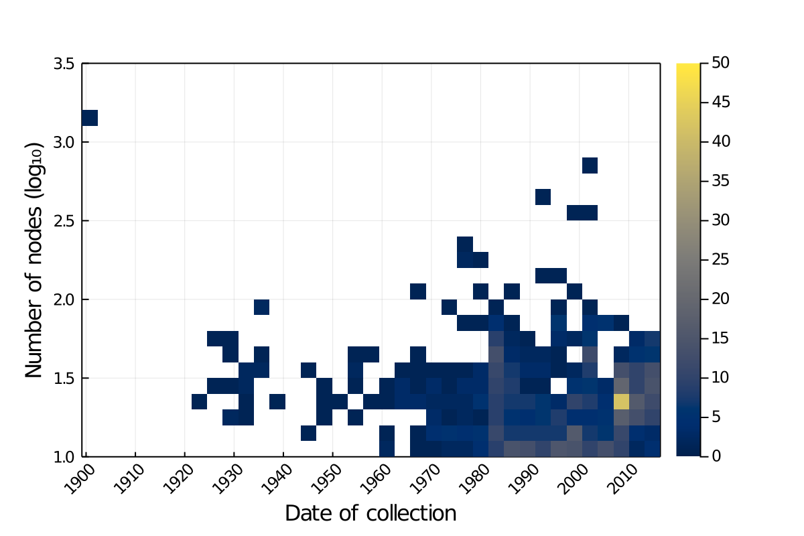

Ecological networks are a useful representation of ecological systems in which
species or organisms interact [@Heleno2014EcoNet; @Delmas2018AnaEco]. In
addition to using the established mathematical framework of graph theory to
describe the structure of species interactions, network ecology has related the
structural and ecological properties of networks [@Proulx2005NetThi;
@Poulin2010NetAna]. Networks often allow to link disconnected scales in ecology
[@Guimaraes2020StrEco], and in particular are powerful tools to bridge data on
populations to ecosystem properties [@Loreau2010PopEco; @Jordano2013MutNet;
@Gonzalez2020ScaBio]. Recently, the interest in the dynamics of ecological
networks across large temporal scales [@Baiser2019EcoRul;
@Tylianakis2017EcoNet], and along environmental gradients [@Welti2015StrTro;
@Pellissier2017ComSpe; @Trojelsgaard2016EcoNet], has increased. As ecosystems
are changing rapidly, networks are at risk of undergoing rapid and catastrophic
changes to their structure: for example by invasion leading to a collapse
[@Magrach2017PlaNet; @Strong2014ImpNon], or by a "rewiring" of interactions
among existing species [@Hui2019HowInv; @Guiden2019PrePre; @Bartley2019FooWeb].
Simulation studies suggest that knowing the structure of the extant network,
*i.e.* being able to map all interactions between species, is not sufficient
[@Thompson2017DisGov] to predict the effects of external changes; indeed, data
on the species occurrences and traits, as well as local extant and projected
climate, are also required.

This change in scope, from describing ecological networks as local, static
objects, to dynamical ones that vary across space and time, has prompted several
methodological efforts. First, tools to study spatial, temporal, and
spatio-temporal variation of ecological networks in relationship to
environmental gradients have been developed and continuously expanded
[@Poisot2012DisSpe; @Poisot2015SpeWhy; @Poisot2017HosPar]. Second, there has
been an improvement in large-scale data-collection, through increased adoption
of molecular biology tools [@Eitzinger2019AssCha; @Evans2016MerDna;
@Makiola2019KeyQue] and crowd-sourcing of data collection [@Bahlai2016PrePla;
@Roy2016FocPla; @Pocock2015BioRec]. Finally, there has been a surge in the
development of tools allowing to *infer* species interactions
[@Morales-Castilla2015InfBio; @Dallas2017PreCry] based on limited but
complementary data on network properties [@Stock2017LinFil], species traits
[@Gravel2013InfFoo; @Desjardins-Proulx2017EcoInt; @Brousseau2017TraPhy;
@Bartomeus2016ComFra], and environmental conditions [@Gravel2018BriElt]. These
latter approaches tend to perform well in data-poor environments
[@Beauchesne2016ThiOut], and can be combined through ensemble modeling or model
averaging to generate more robust predictions [@Pomeranz2018InfPre;
@Becker2020PreWil]. The task of inferring interactions is particularly important
because ecological networks are difficult to adequately sample in nature
[@Jordano2016ChaEco; @Jordano2016SamNet; @Banasek-Richter2004SamEff;
@Chacoff2012EvaSam; @Gibson2011SamMet]. The common goal to these efforts is to
facilitate the prediction of network structure, particularly over space
[@Poisot2016SynDat; @Albouy2019MarFis] and into the future [@Albouy2014ProSpe],
to appraise the response of that structure to possible environmental changes.

These disparate methodological efforts share another important trait: their
continued success at predicting network structure depends both on
state-of-the-art data management, and on the availability of data that are
representative of the area we seek to model. Novel quantitative tools demand a
higher volume of network data; novel collection techniques demand powerful data
repositories; novel inference tools demand easier integration between different
types of data, including but not limited to: interactions, species traits,
taxonomy, occurrences, and local bioclimatic conditions. Macroecological studies
of networks have demonstrated the importance of integrating network structure
with past and current climate data [@Dalsgaard2013HisCli;@Schleuning2014EcoHis;
@Martin-Gonzalez2015MacPhy], and that even when considering large scale
gradients, similar types of interactions can behave in similar ways, in that
they respond to the same drivers [@Zanata2017GloPat]. That being said,
network-based measures of community structure often bring complementary
information when compared to other sources of data [like abundance;
@Dalsgaard2017OppLat].

In short, advancing the science of ecological networks requires us not only to
increase the volume of available data, but also to pair these data with
ecologically relevant metadata. Such data should also be made available in a way
that facilitates programmatic interaction (*i.e.* where the data are processed
automatically and without the need for manual curation) so that they can be used
by reproducible data analysis pipelines. @Poisot2016ManMak introduced
`mangal.io` as the first step in this direction. In the years since the tool was
originally published, we continued the development of data representation,
amount and richness of metadata, and digitized and standardized as much biotic
interactions data as we could find. The second major release of this database
contains over 1300 networks, 120000 interactions across close to 7000 taxa, and
represents what is to our best knowledge the most complete collection of species
interactions available.

Here we ask if the current Mangal database is fit for global-scale synthesis
research into ecological networks. A recent study by @Cameron2019UneGlo suggest
that food webs are un-evenly documented globally, but focused on *metadata*
as opposed to actual datasets. Here, we conclude that interactions over most
of the planet's surface are poorly described, despite an increasing amount
of available data, due to temporal and spatial biases in data collection and
digitization. In particular, Africa, South America, and most of Asia have
very sparse coverage. This suggests that synthesis efforts on the worldwide
structure or properties of ecological networks will be weaker within these
areas. To improve this situation, we should digitize available network
information and prioritize sampling towards data-poor locations.

# Global trends in ecological networks description

## Network coverage is accelerating but spatially aggregated

![Cumulative number of ecological networks available in `mangal.io` as a function of the date of collection. About 1000 unique networks have been collected between 1987 and 2017, a rate of just over 30 networks a year. This temporal increase proceeds at different rates for different types of networks; while the description of food webs is more or less constant, the global acceleration in the dataset is due to increased interest in host-parasite interactions starting in the late 1970s, while mutualistic networks mostly started being recorded in the early 2000s.](figures/network_growth_over_time.png){#fig:temporal}

The earliest recorded ecological networks date back to the late nineteenth
century, with a strong increase in the rate of collection around the 1980s
(@fig:temporal). Although the volume of available networks has increased over
time, the sampling of these networks in space has been uneven. In @fig:spatial,
we show that globally, network collection is biased towards the Northern
hemisphere, and that different types of interactions have been sampled in
different places. As such, it is very difficult to find a spatial area of
sufficiently large size in which we have networks of predation, parasitism, and
mutualism. The inter-tropical zone is particularly data-poor, either because
data producers from the global South correctly perceive massive re-use of their
data by Western world scientists as a form of scientific neo-colonialism [as
advanced by @Mauthner2013OpeAcc], thereby providing a powerful incentive
*against* their publication, or because ecological networks are subject to the
same data deficit that is affecting all fields on ecology in the tropics
[@Collen2008TroBio]. As @Bruna2010SciJou identified almost ten years ago,
improved data deposition requires an infrastructure to ensure they can be
repurposed for future research, which we argue is provided by `mangal.io` for
ecological interactions.

{#fig:spatial}

## Network size did not increase over time

In @fig:size, we report the changes in the number of nodes (usually species,
sometimes functional or trophic groupings) in ecological networks over time -
interestingly, even though the field of network ecology itself is growing
[@Borrett2014RisNet], the overwhelming majority of networks collected to date
remain under a hundred species. This is most likely explained, not by the fact
that ecological networks are necessarily small, but by the immense effort
required to assemble these datasets [@Jordano2016SamNet]. Indeed,
@Jordano2016ChaEco emphasizes that the correct empirical description of
ecological networks requires extensive field work in addition to a profound
knowledge of the natural history of the system. These multiple constraints
contribute to keeping network size small, and might not be indicative of low
data quality.

{#fig:size}

## Different interaction types have been studied in different biomes

@Whittaker1962ClaNat suggested that natural communities can be partitioned
across biomes, largely defined as a function of their relative precipitation and
temperature.  For all networks for which the latitude and longitude were known,
we extracted the value temperature (BioClim1, yearly average) and precipitation
(BioClim12, total annual) from the WorldClim 2 data at a resolution of 10 arc
minutes [@Fick2017Wor2N]. Using these we can plot every network on the map of
biomes drawn by @Whittaker1962ClaNat (note that because the frontiers between
biomes are not based on any empirical or systematic process, they have been
omitted from this analysis). In @fig:biomes, we show that even though networks
capture the overall diversity of precipitation and temperature, types of
networks have been studied in sub-sections of the biomes space only.
Specifically, parasitism networks have been studied in colder and drier
climates; mutualism networks in wetter climates; predation networks display less
of a bias. Interestingly, some combinations of temperature and precipitation
that are abundant on Earth (darker shading) are not represented in our network
dataset, which suggests that we lack knolwedge of some widespread biomes.

{#fig:biomes}

To scale this analysis up to the 19 BioClim variables in @Fick2017Wor2N, we
extracted the position of every network in the bioclimatic space, ranged them so
that they have mean of 0 and unit variance, and conducted a principal component
analysis on the scaled bioclimatic variables. In @fig:pca, we projected the
sampling locations in the resulting subspace formed by the first two principal
components, which capture well over 75% of the total variance in the 19
bioclimatic variables. This ordination has a number of interesting properties.
First, the different types of networks occupy different environmental
combinations, which largely matches the results of @fig:biomes. Second, the
space is more scarcely sampled by networks that contain either mostly predatore
or mostly mutualistic interactions -- although they do cover a larger part of
the space, the distance between them is much greater than compared to
parasitism.

{#fig:pca}

In @fig:ecc, we measure the Euclidean distance to the centroid of the space for
every network. Mutualistic interactions tend to have values that are higher than
predation, which are themselves mostly higher than parasitism. This suggests a
potential bias in that globally, as the growth of digitized ecological networks
was largely driven by parasitic interactions [@fig:temporal], the environments
in which they have been sampled have became over-represented.

{#fig:ecc}

## Some locations on Earth have no climate analog

In figures @fig:envspace, we represent the environmental distance between every
pixel covered by *BioClim* data, and the three networks that were sampled in the
closest environmental conditions (this amounts to a $k$ nearest neighbors with
$k = 3$). In short, higher distances correspond to pixels on Earth for which no
climate analog network exists, whereas the darker areas are well described. It
should be noted that the three types of interactions studied here (mutualism,
parasitism, predation) have regions with no analogs in different locations. In
short, it is not that we are systematically excluding some areas, but rather
than some type of interactions are more studied in specific environments. This
shows how the lack of global coverage identified in @fig:biomes, for example,
can cascade up to the global scale. These maps serve as an interesting measure
of the extent to which spatial predictions can be trusted: any extrapolation of
network structure in an area devoid of analogs should be taken with much greater
caution than an extrapolation in an area with many similar networks.

{#fig:envspace}

# Conclusions

## For what purpose are global ecological network data fit?

What can we achieve with our current knowledge of ecological networks? The
overview presented here shows a large and detailed dataset, compiled from almost
every major biome on earth. It also displays our failure as a community to
include some of the most threatened and valuable habitats in our work. Gaps in
any dataset create uncertainty when making predictions or suggesting causal
relationships. This uncertainty must be measured by users of these data,
especially when predicting over the "gaps" in space or climate that we have
identified. We are not making any explicit recommendations for synthesis
workflows. Rather we argue that this needs to be a collective process, a
collaboration between data collectors (who understand the deficiencies of these
data) and data analysts (who understand the needs and assumptions of network
methods).

One line of research that we feel can confidently be pursued lies in
extrapolating the structure of ecological networks over gradients, not at the
level of species and their interactions, but at that of the community.
@Mora2018IdeCom revealed that all food webs are more or less built upon the same
structural backbone, which is in part due to strong evolutionary constraints on
the establishment of species interactions [@DallaRiva2015ExpEvo]; in other
words, most networks are expected to be variations on a shared theme, and this
facilitates the task of predicting the overarching structure greatly. Finally,
this approach to prediction which neglects the composition of networks is
justified by the observation that network structure tends to be maintained at
very large spatial scales even in the presence of strong compositional turnover
[@Dallas2017ComTur; @Kemp2017InvAnt].

## Can we predict the future of ecological networks under climate change?

Perhaps unsurprisingly, most of our knowledge on ecological networks is derived
from data that were collected after the 1990s (@fig:temporal). This means that
we have worryingly little information on ecological networks before the
acceleration of the climate crisis, and therefore lack a robust baseline.
@Dalsgaard2013HisCli provide strong evidence that the extant shape of ecological
networks emerged in part in response to historical trends in climate change. The
lack of reference data before the acceleration of the effects of climate change
is of particular concern, as we may be deriving intuitions on ecological network
structure and assembly rules from networks that are in the midst of important
ecological disturbances. Although there is some research on the response of
co-occurrence and indirect interactions to climate change [@Araujo2011UsiSpe;
@Losapio2017ResPla], these are a far cry from actual direct interactions;
similarly, the data on "paleo-foodwebs", *i.e.* from deep evolutionary time
[@Muscente2018QuaEco; @Yeakel2014ColEco; @Nenzen2014Imp850] represent the effect
of more progressive change, and may not adequately inform us about the future of
ecological networks under severe climate change. However, though we lack
baselines against which to measure the present, as a community we are in a
position to provide one for the future. Climate change will continue to have
important impacts on species distributions and interactions for at least the
next century. The Mangal database provides a structure to organize and share
network data, creating a baseline for future attempts to monitor and adapt to
biodiversity change.

Possibly more concerning is the fact that the spatial distribution of sampled
networks shows a clear bias towards the Western world, specifically Western
Europe and the Atlantic coasts of the USA and Canada (@fig:spatial). This
problem can be somewhat circumvented by working on networks sampled in places
that are close analogs of those without direct information (almost all of
Africa, most of South America, a large part of Asia). However, @fig:envspace
suggests that this approach will rapidly be limited: the diversity of
bioclimatic combinations on Earth leaves us with some areas lacking suitable
analogs. These regions are expected to bear the worst of the socio-economical
(*e.g.* Indonesia) or ecological (*e.g.* polar regions) consequences of climate
change. @Cameron2019UneGlo reached a similar conclusion by focusing on food
webs, and our analysis suggests that this worrying trend is, in fact, one that
is shared by almost all types of interactions. All things considered, our
current knowledge about the structure of ecological networks at the global scale
leaves us under-prepared to predict their response to a warming world. From the
limited available evidence, we can assume that ecosystem services supported by
species interactions will be disrupted [@Giannini2017ProCli], in part because
the mismatch between interacting species will increase [@Damien2019PrePhe]
alongside the climatic debt accumulated within interactions
[@Devictor2012DifCli].

## Active development and data contribution

This is an open-source project: all data and all code supporting this manuscript
are available on the Mangal project GitHub organization, and the figures
presented in this manuscript are themselves packaged as a self-contained
analysis which can be run at any time. We hope that the success of this project
will encourage similar efforts within other parts of the ecological community.
Besides, we hope that this project will encourage the recognition of the
contribution that software creators make to ecological research.

One possible avenue for synthesis work, including the contribution of new data
to Mangal, is the use of these published data to supplement and extend existing
ecological network data. This "semi-private" ecological synthesis could begin
with new data collected by authors -- for example, a host-parasite network of
lake fish in Africa, or a pollination network of hummingbirds in Brazil. Authors
could then extend their analyses by including a comparison to analogous data
made public in Mangal. Upon the publication of the research paper, the original
data could be uploaded to Mangal. This enables the reproducibility of this
particular published paper. Even more powerfully, it allows us to build a future
of dynamic ecological analyses, wherein analyses are automatically re-done as
more data get added. This would allow a sort of continuous assessment of
proposed ecological relationships in network structure. This cycle of data
discovery and reuse is an example of the Data Life Cycle [@Michener2015TenSim]
and represents one way to practice ecological synthesis.

The idea of continuously updated analyses is very promising. Following the
template laid out by @White2019DevAut and @Yenni2019DevMod, it is feasible to
update a series of canonical analyses any time the database grows, to produce a
living, automated synthesis of ecological networks knowledge. To this end, the
Mangal database has been integrated with `EcologicalNetworks.jl`
[@Poisot2019EcoJl], which allows the development of flexible network analysis
pipelines. One immediate target would be to borrow the methodology from
@Carlson2019WhaWou, and provide an estimate of the sampling effort required to
accurately describe combinations of interaction types and bioclimatic conditions
at various places on Earth, to provide recommendations on sampling effort
allocation. Tightening the integration between infrastructure, data, and models,
contributes to building the capacity of our field to bring about iterative
near-term forecasting of ecological network structure [@Dietze2018IteNea].

## What problems would more data solve?

As the amount of empirical evidence grows, so too should our understanding of
existing relationships between network properties, between networks properties
and space, and the interpretation to be drawn from them. But what information
would the structure of the food web from a pond bring to our understanding of
the plant-pollinator interactions around it? Or to a food web in another pond a
few kilometers from here? In short, will we get a lot more insights by
accumulating data? Before answering this question (in the affirmative), it
matters to recognize that, as @Hortal2015SevSho pointed out, biotic interactions
are a core part of biodiversity; the Eltonian shortfall, manifested in our lack
of widespread data about them, in as much of an impediment to our mission as
ecologists as the absence of data on phylogeny or species occurrence would be.
As a conclusion to this article, we would like to frame the aggregation of data
on species interaction networks in standardized databases as both a requirement
justified by fundamental science, and as an opportunity to conduct novel
experiments on the prediction of ecological networks. In fact, re-analysis of
the raw food web data contained in `mangal.io` recently allowed
@MacDonald2020RevLin to develop a novel model of food web structure, which
outperforms previous proposition for the relationship between species richness
and link number.

First, we *require* to collect data on species interactions following their
measurement *in situ* because there is mounting evidence that they cannot
reliably be inferred from observing the two species in co-occurrence; this has
been shown through experimental and modeling approaches [@Barner2018FunCon;
@Thurman2019TesLin]. A recent synthesis by @Blanchet2020CooNot also reveals how
the assumption that co-occurrence will inform our knowledge of species
interactions as wholly unsupported by the corpus of ecological theories. With
the mounting amount of information on species distribution, and initiatives like
GBIF storing over a billion record of occurrences, inferring interactions this
ways was tempting; sadly, it appears unfeasible, leaving the curation of
interaction data as the justifiable decision moving forward.

Second, we *should* collect data on species interactions following their
measurement *in situ*, because this will enable the development of new
generation of general models. Initial guidelines by @Morales-Castilla2015InfBio
have led to an increase in the development and application of forecasting
methods (reviewed in the introduction of this manuscript), and it is now clear
that coupling data on species interaction, occurrences, traits
[@Schleuning2020TraAss], phylogeny, is going to lead to powerful predictive
models of community structure. While knowing the structure of the food web of
two ponds a few kilometers apart is not going to qualitatively change our
understanding of food webs as a whole, the accumulation of data about different
interactions in multiple environments will allow us to hunt for generalities,
and identify rules that govern the assemblage of ecological networks.

Third, we should focus on digitizing, or collecting, time series of network
structure. Networks are known to vary over short [@Trojelsgaard2016EcoNet], long
[@Burkle2013PlaInt], and very long [@Nenzen2014Imp850] periods of time, and
having the ability to track changes of a network through time will provide
important answers as to the suitability of a single, discrete sampling timepoint
to serve as a reference state for the history of the entire network. This is of
particular relevance as we now have both population time-series for various
community assemblages [@Dornelas2018BioDat], and the quantitative tools to
analyse time-series of complex interactions [@Ovaskainen2017HowAre].

In conclusion, by accumulating more data, we will increase the overlap between
different databases (phylogeny, genetics, occurrences, functional traits), which
will contribute to the unification of our knowledge of biodiversity, a task
which is currently hampered by disconnectedness between data describing
different aspects of community structure and composition [@Poisot2019EcoDat].
The work of predicting species interactions would be streamlined by both (i)
establishing and using a standardized database for species interactions with
contextual metadata, and (ii) ensuring the compatibility of this database with
other sources, through the use of established species identifiers. The `mangal`
data specification (and database) solves both issues, and we are confident that
through sustained data deposition, it will contribute to our ability to predict
the structure of ecological networks.

**Data and code availability:**

All code is available openly at
`https://github.com/PoisotLab/MangalSamplingStatus`, and the data can be
retrieved from `mangal.io` and the BioClim database using the specified files.
Also, weekly updated pages presenting the analyses reported in this manuscript,
including the data files, are available at
`https://poisotlab.github.io/MangalSamplingStatus/`.

# References
